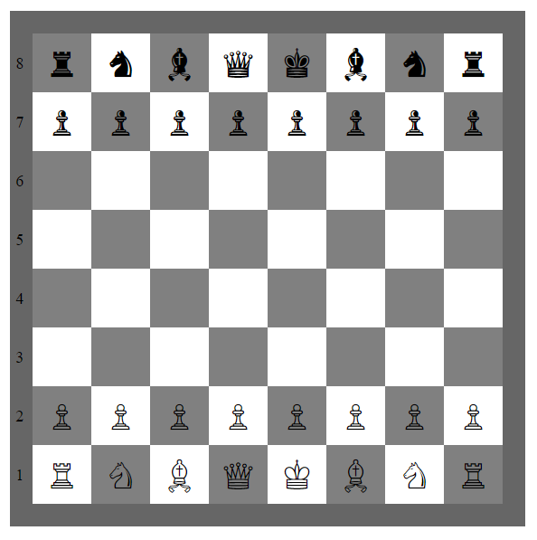

# Chessboard Assignment

## Overview
This project is a simple implementation of a chessboard using HTML and basic CSS. The chessboard is created using an HTML `<table>` element with alternating colored squares representing the black and white squares of a traditional chessboard. The chess pieces are represented by Unicode characters.

## Project Structure
- **index.html**: The main HTML file that contains the structure of the chessboard.

## How It Works
- The chessboard is built using an HTML `<table>` with each cell (`<td>`) representing a square on the board.
- CSS is used to apply the alternating colors to the board's squares.
- Unicode characters are used to represent the chess pieces, with each piece placed in its respective starting position.

## Usage
To view the chessboard:
1. Open the `index.html` file in a web browser.
2. The chessboard will be displayed with all pieces in their starting positions.

## Example Output
The chessboard will look something like this:

## Notes
- This implementation uses basic HTML and CSS without JavaScript.
- It is a static chessboard and does not support interactivity or game logic.
